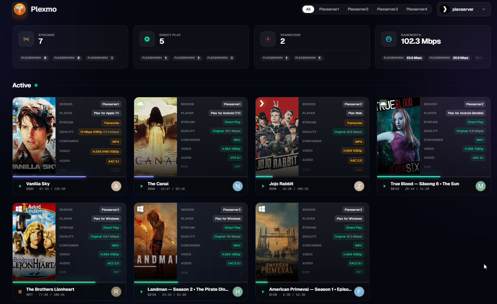
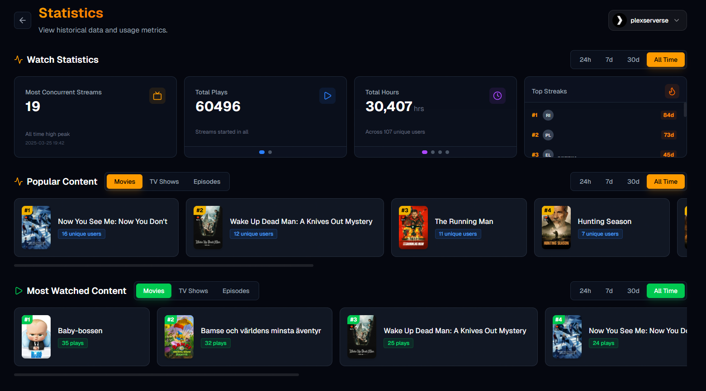
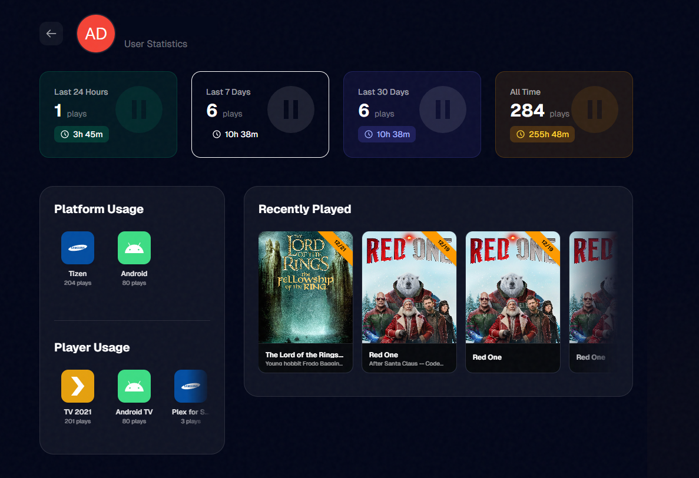
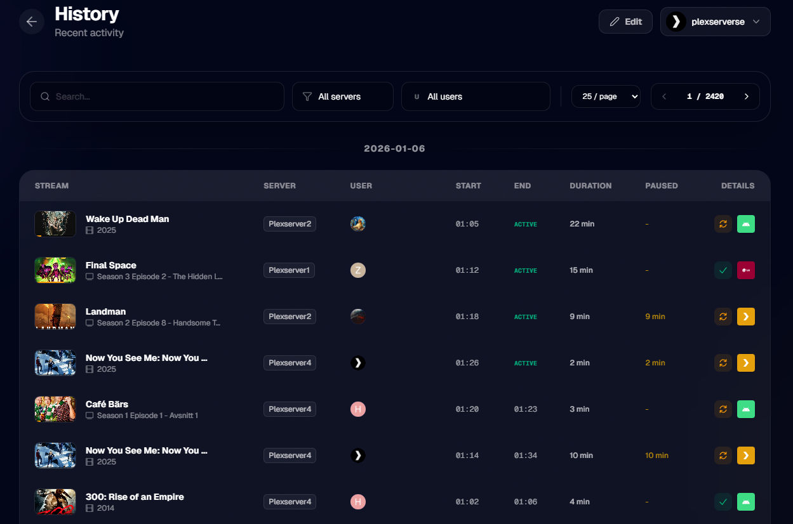
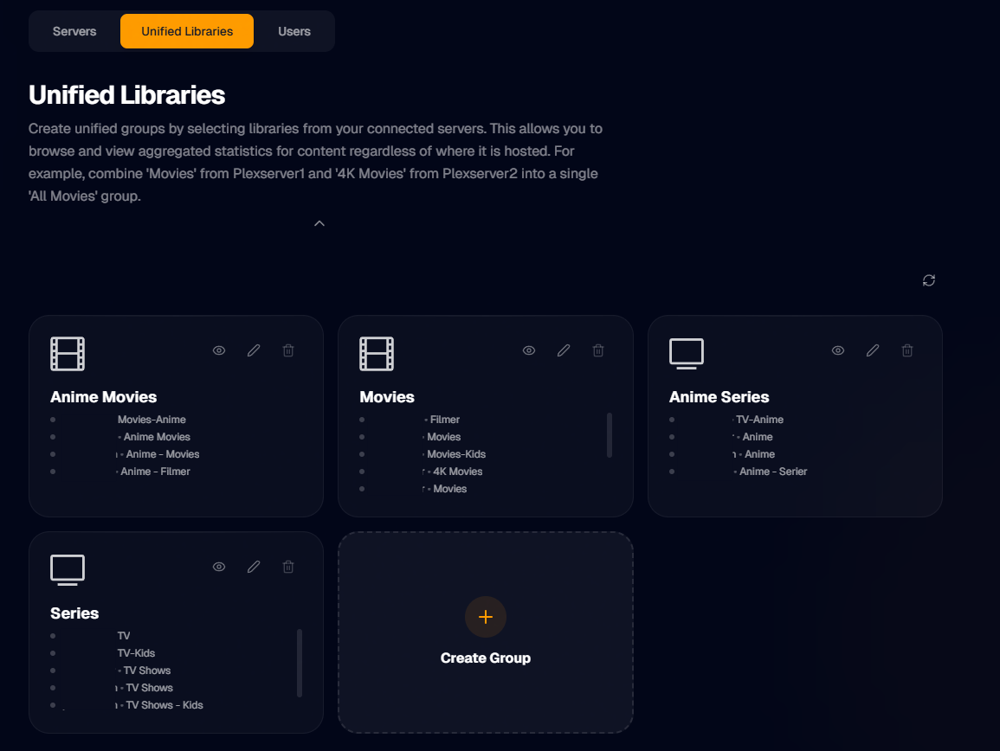
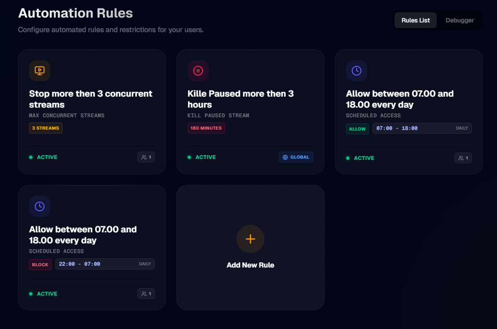

# Plexmo

[](https://github.com/thu3n/plexmo/blob/main/LICENSE)
[](https://github.com/thu3n/plexmo)

Plexmo is a free and open source monitoring and analytics dashboard for your Plex ecosystem. Designed as a modern alternative to Tautulli, Plexmo's standout feature is **native multi-server support** - seamlessly monitor and manage multiple Plex servers from a single, beautiful interface. Built with a focus on simplicity and aesthetics, it provides deep insights into your media library and viewing patterns across your entire Plex infrastructure.



## Features

- **Real-time Session Monitoring** - Monitor active streams across all connected Plex servers simultaneously with detailed playback information
- **Advanced Statistics** - Comprehensive analytics including watch history, user behavior, content trends, and viewing streaks
- **Unified Library Groups** - Combine libraries across multiple servers for seamless content browsing and management
- **Tautulli Import** - Seamless migration of your watch history from Tautulli
- **Discord Integration** - Push notifications and activity updates directly to your Discord server
- **Multi-admin Authentication** - Secure access control with Plex-based authentication for administrators
- **Responsive Design** - Mobile-friendly interface that's continuously evolving with ongoing improvements

<details>
<summary>📸 View Screenshots</summary>

### Statistics Dashboard


### User Statistics


### Watch History


### Unified Libraries


### Automation Rules


</details>

## Roadmap

- **Statistics** - More statistics with top watchers, most popular servers, and percentage-based rankings
- **Advanced Notifications** - Enhanced Discord alerts with Email and Telegram support
- **Granular Exports** - Export watch history or settings independently
- **Scheduled Backups** - Automated backup scheduling
- **Stream Control** - Manual stream termination and rule-based auto-kill for 4K transcodes
- **Overseerr Integration** - User request statistics and habits tracking

## Getting Started

Check out the documentation for detailed installation instructions.

**Docker (Recommended)**

```bash
docker pull ghcr.io/thu3n/plexmo:latest

docker run -d \
  --name plexmo \
  -p 3000:3000 \
  -v plexmo-data:/app/data \
  ghcr.io/thu3n/plexmo:latest
```

Or use Docker Compose:

```yaml
version: '3.8'
services:
  plexmo:
    image: ghcr.io/thu3n/plexmo:latest
    container_name: plexmo
    ports:
      - "3000:3000"
    volumes:
      - plexmo-data:/app/data
    restart: unless-stopped

volumes:
  plexmo-data:
```

**Manual Installation**

```bash
git clone https://github.com/thu3n/plexmo.git
cd plexmo

npm install
npm run build
npm start
```

Open [http://localhost:3000](http://localhost:3000) and complete the setup wizard to connect your Plex server.

## Support

- Bug reports and feature requests can be submitted via [GitHub Issues](https://github.com/thu3n/plexmo/issues)
- Questions and discussions are welcome in [GitHub Discussions](https://github.com/thu3n/plexmo/discussions)

## Contributing

Plexmo is developed in the **vibe coded** philosophy - prioritizing aesthetic minimalism, intuitive UX, and efficient functionality. Contributions are welcome! Please feel free to submit pull requests or open issues for bugs and feature requests.

## License

Plexmo is licensed under the [MIT License](LICENSE).

---

**Note:** This project is developed independently and is not affiliated with Plex Inc.
