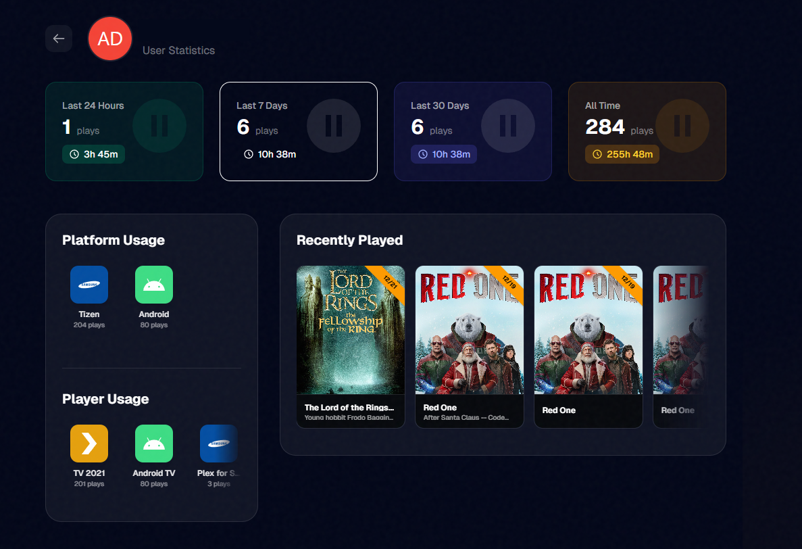
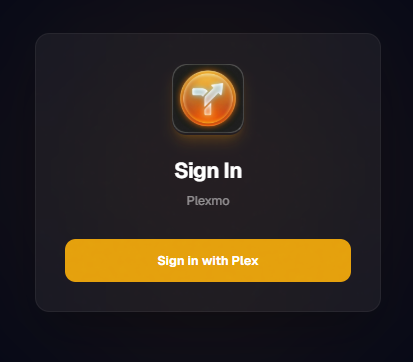

<div align="center">

# Plexmo
### The Modern, Multi-Server Plex Monitor

[](https://opensource.org/licenses/MIT)


**"Vibe Coded" & Under Development:** Things can and will break. Use at your own risk!

</div>

---

**Plexmo** is a self-hosted dashboard for deep insights into your Plex Media Servers. Monitor active sessions, bandwidth, and library stats across multiple servers in a single, modern interface.


## 🚀 Quick Start (Docker)

Get up and running in seconds. Copypaste this into a `docker-compose.yml`:

```yaml
version: '3'
services:
  plexmo:
    image: ghcr.io/thu3n/plexmo:latest
    container_name: plexmo
    environment:
      - TZ=Europe/Stockholm
      - PORT=3000
    ports:
      - "3000:3000"
    volumes:
      - ./config:/app/config
    restart: unless-stopped
```

Run it:
```bash
docker-compose up -d
```
Open [http://localhost:3000](http://localhost:3000).

---

## ✨ Features at a Glance

### 🖥️ Multi-Server Support
Monitor unlimited Plex servers from one place. Seamlessly switch views or aggregate data.

### 📥 Tautulli Import
Migrating? Bring your history from Tautulli with you

### 📱 Mobile First
Fully responsive design. Looks stunning on your phone, tablet, or desktop.
### Deep User Stats
Know exactly who is watching what.


### Secure & Easy Access
Built-in auth and easy server management.
<div style="display: flex; gap: 10px;">
  
  
</div>

---

## ⚙️ Configuration

| Variable | Default | Description |
| :--- | :--- | :--- |
| `PORT` | `3000` | Application port |
| `TZ` | `UTC` | Timezone for logs |
| `DATABASE_URL` | `file:../config/dev.db` | SQLite DB path (Internal) |

**Volumes:**
*   `/app/config`: Check this folder to backup your DB.
*   `/mnt/tautulli`: (Optional) For importing existing Tautulli history.

---

## 🗺️ To-Do & Roadmap

**User Portal (Future Feature):**
A separate, secure container instance (running `PLEXMO_MODE=portal`) designed to be exposed externally via reverse proxy. This allows regular Plex users (friends & family) to log in with their own Plex credentials and manage their own "Scheduled Access" rules, without ever exposing the main Admin dashboard or sensitive settings to the public internet.

### 📊 Watch Statistics
*   **Most concurrent streams**: Track peak usage times.
*   **Most watched movies & shows**: Ranked by total play count.
*   **Most popular movies & shows**: Ranked by unique viewer count.
*   **Most active user**: Identify power users based on play history.

### 🏆 Leaderboards (Admin Only)
*   **Top Watchers & Most Popular Servers**: Gamify statistics for your users.
*   **Percentage-based rankings**: Compare active vs total users.

### 🔔 Advanced Notifications
*   **Enhanced Alerts**: Rich notifications for Discord (with posters/user details), and potential Email/Telegram integration.

### 💾 Export/Import Improvements
*   **Granular Export**: Option to export only history, only settings, or full backups.
*   **Scheduled Automated Backups**: Set and forget database protection.
*   **JSON/CSV Export**: Raw data export for external analysis.

### 🛑 Stream Control
*   **Manual Remote Kill**: Stop active streams directly from the dashboard.
*   **Rule-based User Control**: Allow users to "self-kill" streams if they violate their own schedules.

### 📥 Overseerr Statistics
*   **Integration**: View user request stats (total requests, fulfillment rate) alongside watch history.

<div align="center">
  <small>Built with ❤️ by <a href="https://github.com/thu3n">Thu3n</a></small>
</div>
