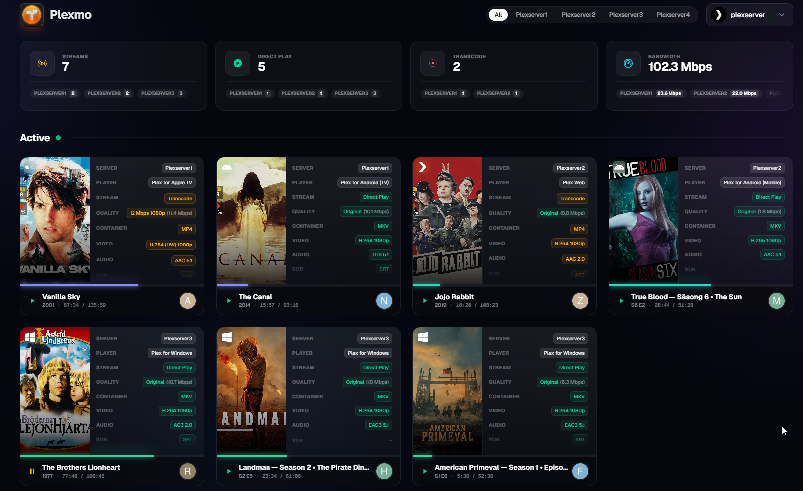
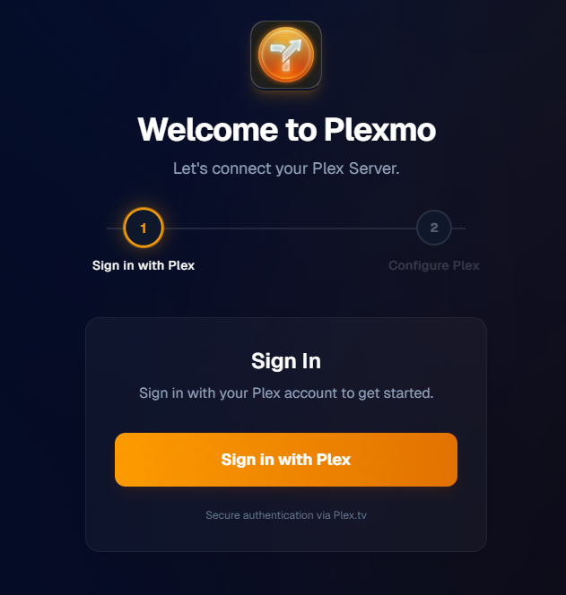
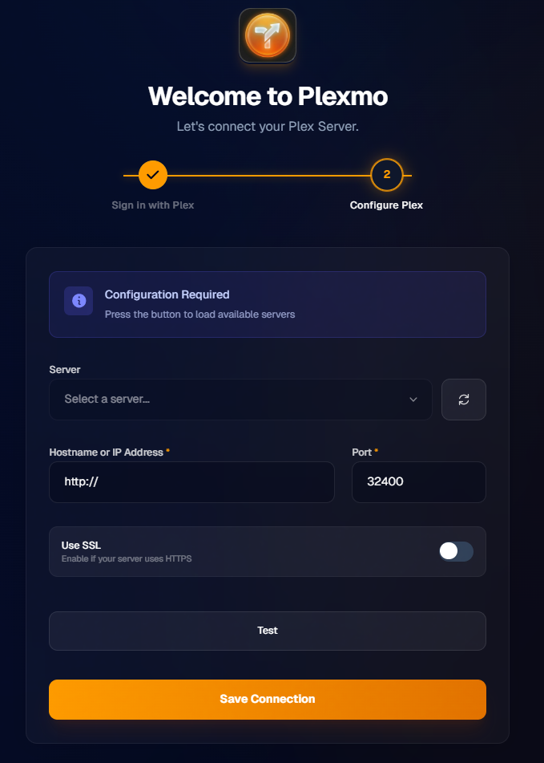
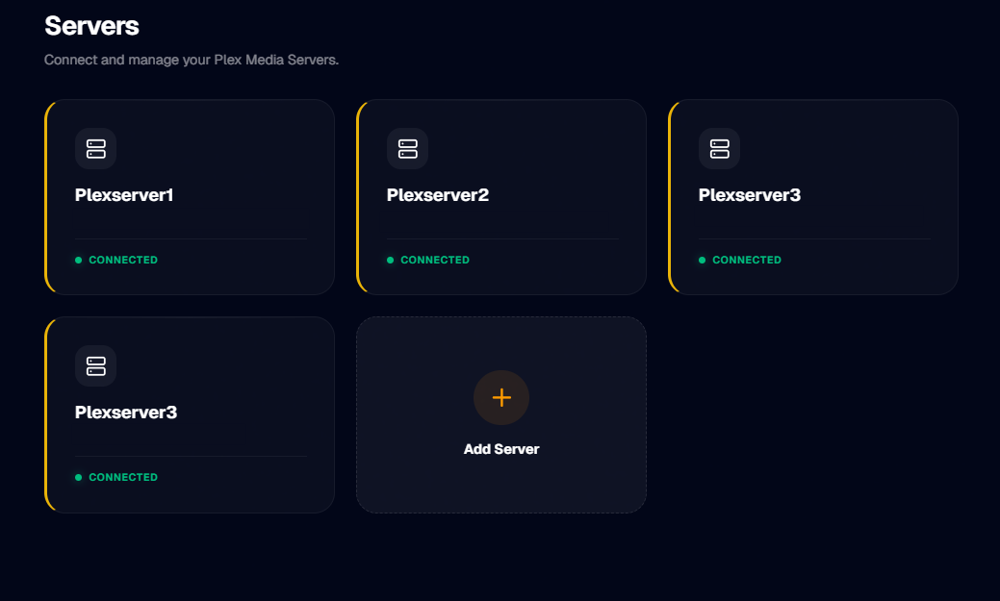
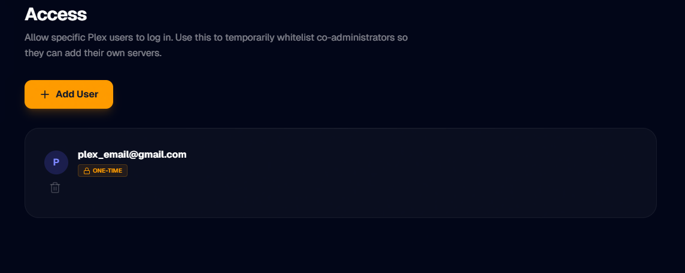

<div align="center">

# Plexmo
### The Modern, Multi-Server Plex Monitor

[](https://opensource.org/licenses/MIT)


<br />

> [!WARNING]
> **⚠️ "Vibe Coded" & Under Development**
>
> This project is **"vibe coded"** (built experimentally and rapidly). It is in active development, which means things **can and will break**. Use it at your own risk and feel free to report bugs!

[Report Bug](https://github.com/thu3n/plexmo/issues) · [Request Feature](https://github.com/thu3n/plexmo/issues)

</div>

---

## 📖 About

**Plexmo** is a modern, web-based dashboard designed to give you deep insights into your Plex Media Servers. Whether you manage a single home server or a multi-server setup, Plexmo provides real-time monitoring of sessions, bandwidth usage, library statistics, and transcoding details in a sleek, responsive interface.

Built with performance and aesthetics in mind, it leverages the latest web technologies to deliver a premium user experience.

## ✨ Features

- **📊 Real-time Dashboard**: Live view of active sessions, bandwidth consumption, and library growth.
- **🖥️ Multi-Server Support**: Seamlessly monitor multiple Plex servers from a unified interface.
- **🎬 Deep Session Insights**: detailed breakdown of streams—know exactly who is watching what, and if it's Direct Play, Direct Stream, or Transcoding.
- **🔄 Tautulli Import**: seamless migration of your history from Tautulli.
- **📱 Responsive Design**: A "Mobile First" approach ensures it looks stunning on your phone, tablet, or desktop.
- **🔐 Secure Access**: Built-in authentication and user management control.
- **🎨 Modern UI**: Dark mode defaults, glassmorphism effects, and smooth animations.

## 🛠️ Built With

*   **[Next.js 16](https://nextjs.org/)** - The React Framework for the Web.
*   **[React 19](https://reactjs.org/)** - For building user interfaces.
*   **[Tailwind CSS v4](https://tailwindcss.com/)** - For rapid, utility-first styling.
*   **[Prisma](https://www.prisma.io/)** - Next-generation ORM for Node.js and TypeScript.
*   **[Better SQLite3](https://github.com/WiseLibs/better-sqlite3)** - Fastest SQLite driver for Node.js.
*   **[Docker](https://www.docker.com/)** - For consistent deployment.

---

## 📸 Screenshots

### The Dashboard


### Easy Configuration
<div style="display: flex; gap: 10px;">


</div>

### Powerful Settings
<div style="display: flex; gap: 10px;">


</div>

---

## 🚀 Getting Started

They easiest way to get Plexmo up and running is with Docker.

### Option 1: Docker Compose (Recommended)

1.  Create a `docker-compose.yml` file:

    ```yaml
    version: '3'
    services:
      plexmo:
        image: ghcr.io/thu3n/plexmo:latest
        container_name: plexmo
        environment:
          - TZ=Europe/Stockholm
          - PORT=3000
          # [OPTIONAL] Sets the default start folder for the file browser
          # - TAUTULLI_PATH=/mnt/tautulli
        ports:
          - "3000:3000"
        volumes:
          - ./config:/app/config
          # [REQUIRED for Import] Mount your Tautulli folder so the container can see it.
          # Format: /path/on/host:/path/in/container:ro
          # - /path/to/tautulli:/mnt/tautulli:ro
        restart: unless-stopped
    ```

2.  Run the container:

    ```bash
    docker-compose up -d
    ```

3.  Open your browser and navigate to `http://localhost:3000`.

### Option 2: Manual Installation

If you prefer to run it bare-metal or for development:

1.  **Clone the repository**
    ```bash
    git clone https://github.com/thu3n/plexmo.git
    cd plexmo
    ```

2.  **Install dependencies**
    ```bash
    npm install
    # or
    yarn install
    ```

3.  **Setup Environment**
    Create a `.env` file if needed, or rely on defaults.
    
    *Note: The app uses SQLite by default, which requires no external database setup.*

4.  **Run the development server**
    ```bash
    npm run dev
    ```

5.  **Build for production**
    ```bash
    npm run build
    npm start
    ```

---

## ⚙️ Configuration

### Environment Variables

| Variable | Description | Default |
| :--- | :--- | :--- |
| `PORT` | Port the application runs on | `3000` |
| `TZ` | Timezone for correct log timestamps | `UTC` |
| `DATABASE_URL` | Path to SQLite DB (Internal) | `file:../config/dev.db` |
| `TAUTULLI_PATH` | Default start folder for file browser | *(Optional)* |

### Volume Mounts (Docker)

| Volume | Description |
| :--- | :--- |
| `/app/config` | Stores the SQLite database and configuration files. **Persist this to save data.** |
| `/mnt/tautulli` | (Optional) Mount your Tautulli folder here to import history. |

---

## 📝 To-Do & Roadmap

- [ ] **Watch Statistics**:
    - Most concurrent streams
    - Most watched movies & shows (based on total plays)
    - Most popular movies & shows (based on unique viewers)
    - Most active user (based on plays)
- [ ] **Leaderboards (Admin Only)**:
    - Top Watchers & Most Popular Servers
    - Percentage-based rankings (active users vs total users)
- [ ] **Advanced Notifications**: Enhanced alerts for Discord, and potentially Email/Telegram support.
- [ ] **Export/Import Improvements**:
    - Granular export (history only, settings only)
    - Scheduled automated backups
    - JSON/CSV export for external analysis
- [ ] **Stream Control**:
    - Manual remote kill (stop active streams)
    - Rule-based auto-kill (e.g., "Kill if paused > 30m", "Kill 4K transcodes")
- [ ] **Overseerr Statistics**: Integrated user stats (e.g., total requests made, request habits).

---

## 🤝 Contributing

Contributions are what make the open source community such an amazing place to learn, inspire, and create. Any contributions you make are **greatly appreciated**.

1.  Fork the Project
2.  Create your Feature Branch (`git checkout -b feature/AmazingFeature`)
3.  Commit your Changes (`git commit -m 'Add some AmazingFeature'`)
4.  Push to the Branch (`git push origin feature/AmazingFeature`)
5.  Open a Pull Request

## 📄 License

Distributed under the MIT License. See `LICENSE` for more information.

---

<div align="center">
  <small>Built with ❤️ by <a href="https://github.com/thu3n">Elias Thuen</a></small>
</div>
